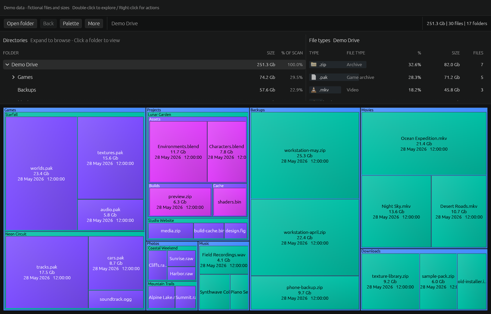
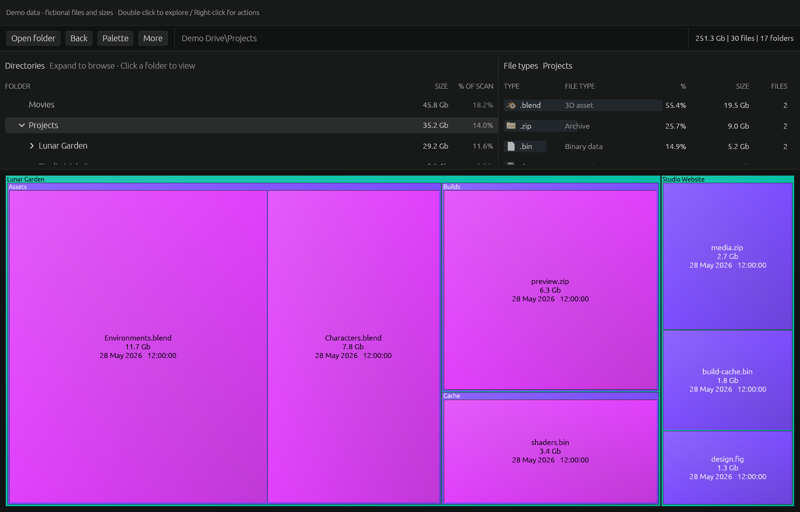
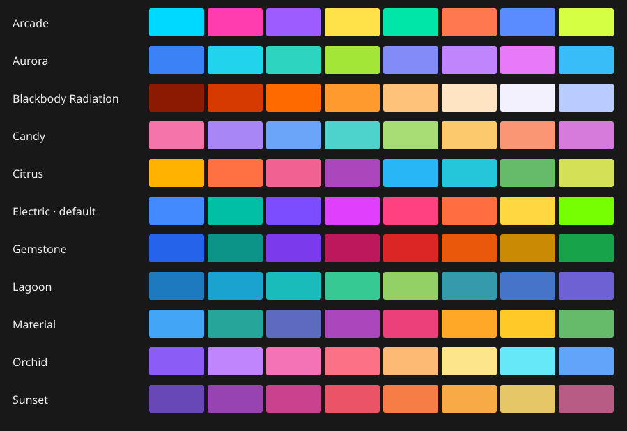
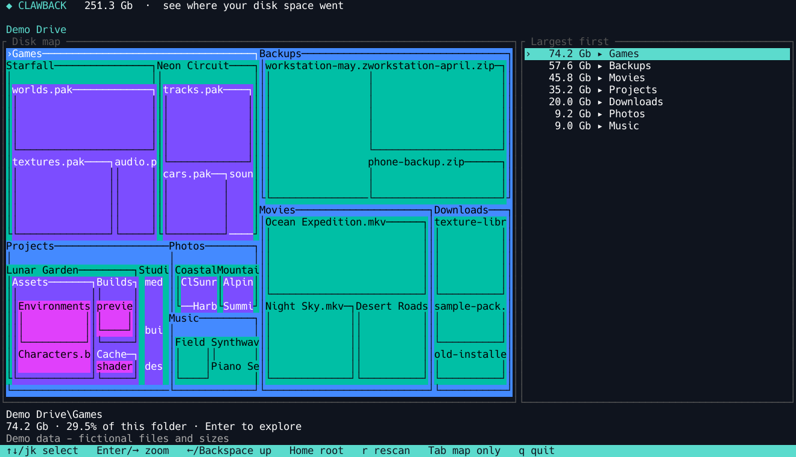

# Clawback

**Your disk is full. See why. Claw it back.**

Clawback turns files and folders into a map you can explore. Big boxes mean big files. Follow the space, find what you no longer need, and watch the map update as you clean up.

A modern, open-source homage to SpaceMonger, with a dark desktop interface and a full terminal mode. Built in Rust for Windows, macOS, and Linux.

[**Downloads**](https://github.com/Azazel-Labs/Clawback/releases) · [Getting started](#get-started) · [User guide](docs/usage.md) · [MIT-0 license](LICENSE)



*Actual app rendering with a fictional demo drive. All screenshot names, sizes, and dates are synthetic.*

## Find the space hogs at a glance

No digging through folder properties one directory at a time. Clawback puts the big picture and the details together: a size-sorted directory tree above a colorful, nested space map.

- **Follow the big boxes.** Double-click a folder bucket to zoom in. File tiles take you into their containing folder.
- **Go back to where you were.** Back, Escape, and your mouse's Back button retrace your visited views.
- **See what a folder contains.** The file-type pane groups extensions by size, share, and file count as you select folders.
- **Keep the data front and center.** Compact progress and stats leave the window for your folders and map. Resize the directory pane to suit your workflow.
- **Make it yours.** Adjust map density, colors, tooltips, and size-accounting options.



*Drill into a folder without losing your way.*

## Quiet chrome. Colorful space.

**Electric** is the default: bright color with soft directional shading. Choose **Palette** to try **Aurora**, **Arcade**, **Citrus**, **Orchid**, or **Gemstone**, alongside **Material**, **Candy**, **Sunset**, **Lagoon**. Enable **Mute colors** to soften any palette while keeping its hues. The panels stay charcoal; the map gets the color. Labels automatically use light or dark text for contrast. Existing saved palette choices are preserved.



## Start exploring before the scan finishes

The map fills in as files are discovered. Scanning runs in the background, so you can navigate the preview, resize the window, or pause and resume the scan without losing progress.

On Windows, whole NTFS volumes use a read-only MFT scan when volume access is available (normally as administrator). This path publishes the map after validating the metadata. Folder scans and other cases use the progressive directory scanner.

Windows directory scans estimate disk usage from file lengths rounded to clusters, keeping scans fast without opening every file. MFT scans retain their allocation metadata and hard-link accounting.

On macOS, the directory scanner uses `getattrlistbulk` to read file metadata in batches. Filesystems that cannot supply bulk metadata automatically fall back to ordinary directory reads. No administrator access is needed.

The directory scanner starts conservatively, using disk type as a hint. It measures throughput and latency, adds workers when they help, and backs off when they hurt. Small scans can finish before tuning is needed.

## Clean up. Watch it change.

After a successful scan, Clawback listens for filesystem changes and updates the map in the background. Delete or move files elsewhere and see the space change without manually rescanning.

Open files, inspect properties, or move unwanted items to the Recycle Bin / Trash from the desktop context menu. **Trash actions happen immediately**; restore items from your system's trash if needed, or disable deletion in Settings.

## Desktop when you want it. Terminal when you need it.

Prefer a keyboard? The terminal interface pairs a colored space map with a size-sorted file list, folder navigation, scan progress, and live updates. Text reports work in scripts and redirected output too.

```sh
clawback                   # Desktop app (also from a terminal)
clawback --tui .           # Interactive terminal map
clawback --report --top 10 .
```



*Captured from the actual terminal renderer using the same fictional dataset as the desktop views.*

The terminal interface is for browsing; file actions are available in the desktop app.

## Get started

1. Choose a build from [Releases](https://github.com/Azazel-Labs/Clawback/releases). Nightly builds are available through the project's release workflow.
2. Launch `clawback.exe` on Windows, or drag `Clawback.app` into Applications on macOS. On Linux, run `clawback` and follow the [desktop launcher setup](docs/usage.md#native-application-icons) for menu integration.
3. Choose **File → Open folder**, choose a drive or folder, and follow the biggest boxes.

Clawback measures what your account can read and reports skipped folders. It does not follow symlinks or Windows junctions. Platform permissions and size-accounting details are in the [user guide](docs/usage.md).

Want to build it yourself? See [Building and development](docs/development.md). Maintainers: [publish a version](docs/releases.md).

Want to help translate the desktop app? See [Crowdin and translation development](docs/translations.md).

## Inspired by a classic. Built for today.

Clawback is a from-scratch Rust homage to [SpaceMonger 1.4](https://github.com/seanofw/spacemonger1), created by Sean Werkema. It reimplements the nested-map experience without including SpaceMonger source code.

**MIT-0 licensed.** Use it, modify it, and make it your own. Copyright © 2026 Azazel Labs. See [LICENSE](LICENSE).
